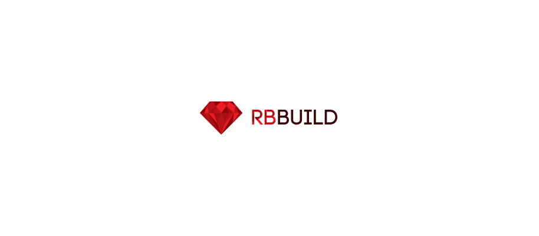
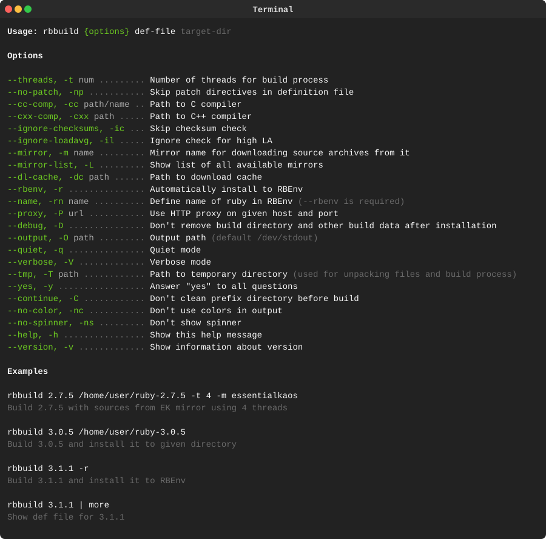
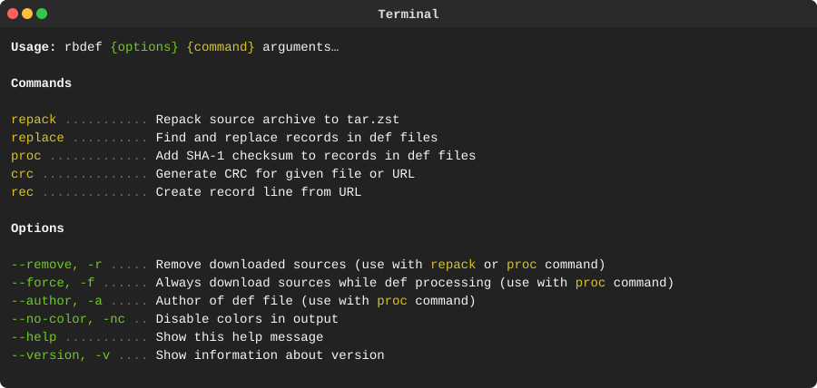
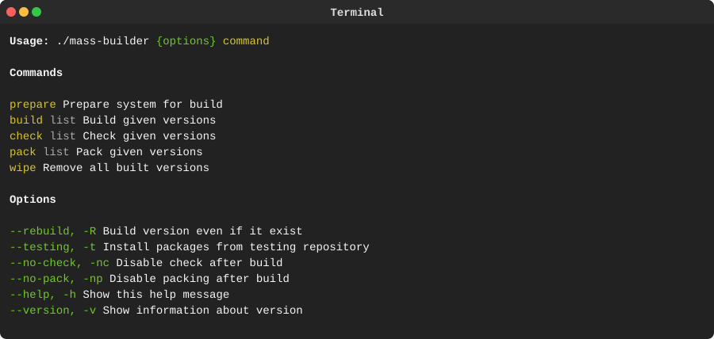

> [!IMPORTANT]
> ### Project Sunset Notice 🌇
>
> ***This project is no longer actively maintained.***
>
> After careful consideration, we’ve decided to sunset development and support for this repository. While it has been a valuable effort, we are no longer able to dedicate the time and resources required to maintain it at the level we consider responsible.
> <details>
> <summary><b>More info</b></summary>
>
> #### What this means
> - No new features or enhancements will be added;
> - Bug fixes and security updates are no longer guaranteed;
> - Issues and pull requests may not receive responses.
>
> #### For existing users
>
> The code will remain available in its current state for reference and continued use under the existing license. However, you should consider migrating to alternative solutions or forking the project if you plan to rely on it long-term.
>
> #### Forking and continuation
>
> If you are interested in taking over maintenance or building upon this project, you are encouraged to fork it.
>
> #### Thank you
>
> We sincerely appreciate everyone who contributed, reported issues, or used this project. Your support made it worthwhile.
> </details>

----

<p align="center"><a href="#readme"></a></p>

<p align="center">
  <a href="https://kaos.sh/w/rbbuild/ci"></a>
  <a href="#license"></a>
</p>

<p align="center"><a href="#usage-demo">Usage demo</a> • <a href="#installation">Installation</a> • <a href="#usage">Usage</a> • <a href="#ci-status">CI Status</a> • <a href="#license">License</a></p>

<br/>

`rbbuild` is utility for compiling and installing different Ruby versions.

### Usage demo

[](#usage-demo)

### Installation

#### From [ESSENTIAL KAOS Public Repository](https://pkgs.kaos.st)

```bash
sudo dnf install -y https://pkgs.kaos.st/kaos-repo-latest.el$(grep 'CPE_NAME' /etc/os-release | tr -d '"' | cut -d':' -f5).noarch.rpm
sudo dnf install rbbuild
```

#### Using Makefile and Git

```bash
git clone https://kaos.sh/rbbuild.git
cd rbbuild
sudo make install
```

### Usage

#### `rbbuild`



#### `rbdef`



#### `mass-builder`



### CI Status

| Branch | Status |
|--------|--------|
| `master` | [](https://kaos.sh/w/rbbuild/ci?query=branch:master) |
| `develop` | [](https://kaos.sh/w/rbbuild/ci?query=branch:develop) |

### License

[Apache License, Version 2.0](https://www.apache.org/licenses/LICENSE-2.0)

<p align="center"><a href="https://essentialkaos.com"></a></p>
